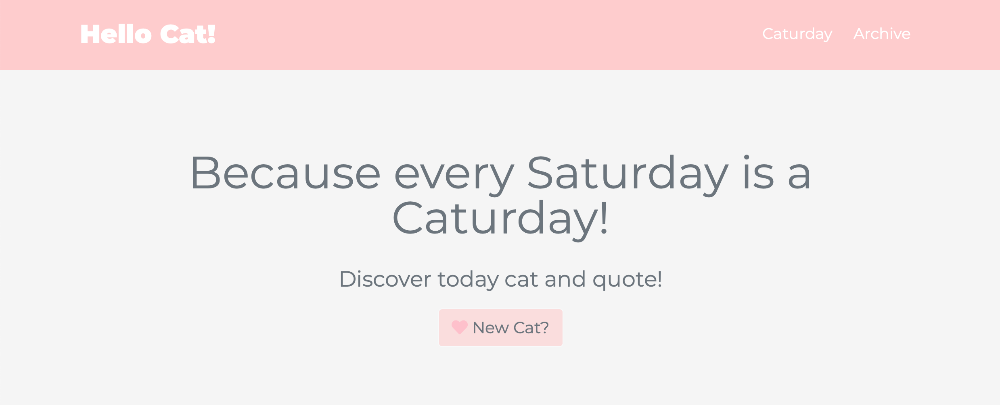
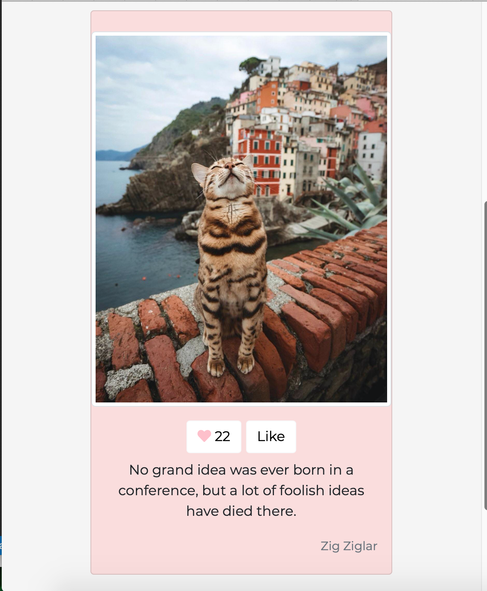
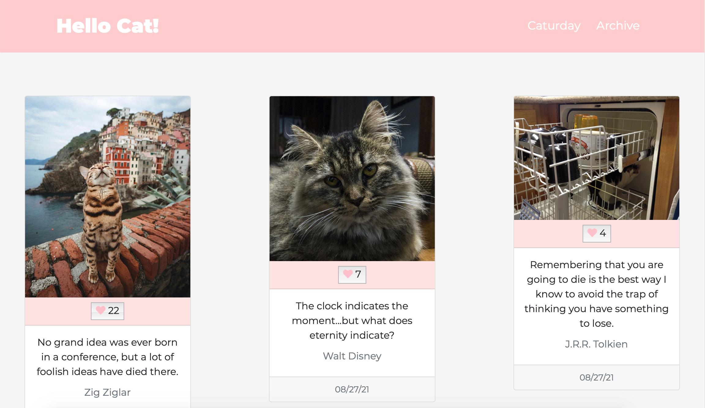
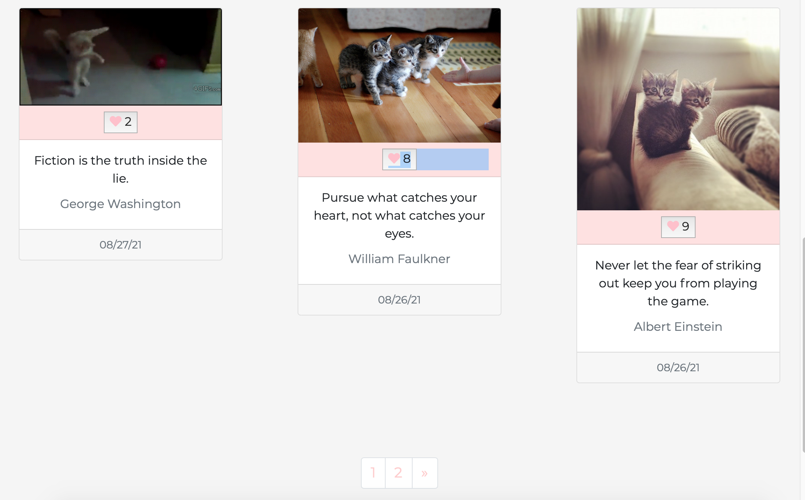
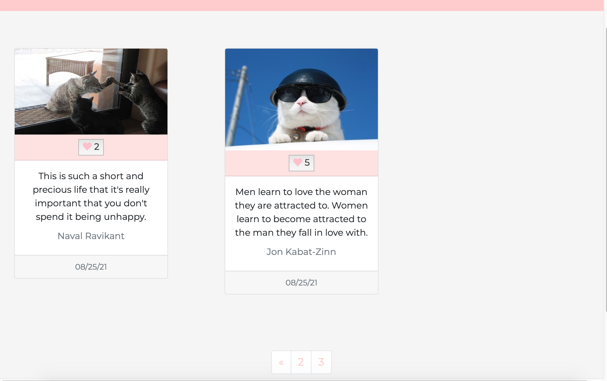
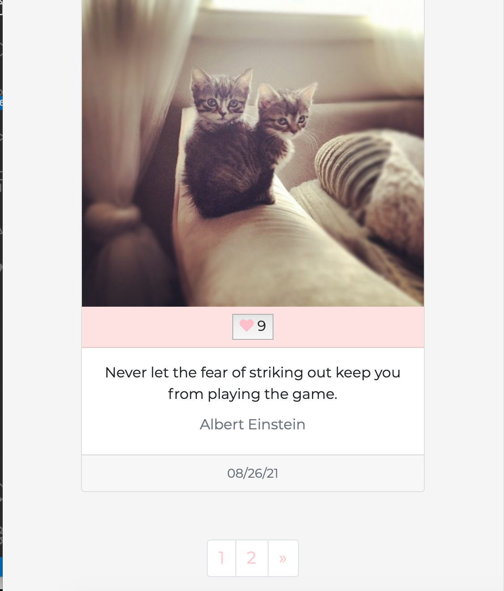

# Caturday Website

## Overview

Dynamic and responsive website aiming to store cat's card. Each Saturday, the users have the ability to generate a new card. A card contains a picture of a cat associated with a quote and a number of likes that the card has received and the date when the card has been added to the website's collection.
All the card information (image url, date added to website, quote and number of likes) is saved into the MongoDB database.
The users can press a "like" button for each image. Then, the new amount of likes is updated in the database.

The website works currently locally. The deployment of the website is in progress.

## Technologies

* Front-end :
  * HTML
  * CSS
  * Javascript
  * Boostrap - version 5.0

* Back-end :
  * Python - version 3.8
  * Flask

* DataBase:
  * MongoDB - version 4.4.5

* API:
  * [Cat API](https://api.thecatapi.com/)
  * [Quote ZEN API](https://zenquotes.io/)

## Usage

On the homepage, the button labelled "New cat?" allows user to generate a new cat's card if the current day is a Saturday. If so, the website fetches the API and generate a new card. The card newest card is displayed on the home page and also saved in the database.

The archive page displays the cards stored containing the cat's image with its added date, quote and number of likes. Depending on the screen view the maximal number of cards displayed per page will vary. 
The pagination button views for navigating through pages are at the bottom of each achieve pages.

The users can press a "like" button for each image. Then, the new amount of likes is updated in the database.

## Requirement

Set yourself an account on MongoDB

## Start the program locally

**Add your MongoDB admin and password**
Modify the file mongodb_config.py by adding your mongoDB admin and password there.

**Add data into your MongoDB database**

The file data.txt contains some data in json format to add to your website.
To add those data into your database, run :

```
python add_items_to_database.py
```

**Start the program to run website**

```
python run.py
```

**View the website**

On the browser 
```
http://127.0.0.1:5000
```

## Images













## ToDo

* Deploy website
* Unittest
* Test the website with Selenium